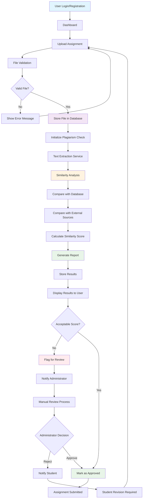

# Plagiarism Checker Workflow

This flowchart shows the complete workflow for the plagiarism checker assignments system.

## Workflow Description

### Key Components:
1. **User Management** - Login/registration system
2. **File Upload & Validation** - Handling assignment submissions
3. **Text Processing** - Extraction and analysis services
4. **Plagiarism Detection** - Similarity checking against database and external sources
5. **Reporting** - Generate and display results
6. **Review Process** - Manual review for flagged submissions
7. **Decision Flow** - Approval or rejection workflow

### Technical Architecture (Laravel-based):
- **Controllers** (app/Http) - Handle user requests and responses
- **Models** (app/Models) - Data management for assignments, users, results
- **Services** (app/Services) - Core plagiarism checking logic
- **Views** (Blade templates) - User interface for uploading and viewing results
- **Database** - Store assignments, similarity scores, and user data

The workflow ensures thorough checking while providing both automated and manual review processes for comprehensive plagiarism detection.

Generated on: 2025-10-02 07:19:52 UTC